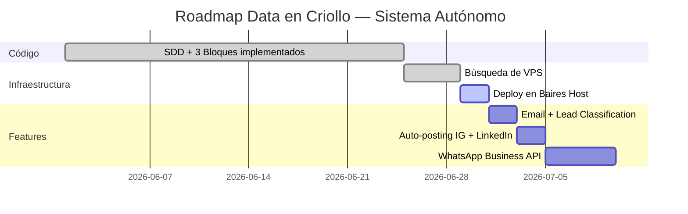

# Data en Criollo — Sistema Autónomo de Consultoría

> **Vos hacés videos. El sistema labura solo.**

Infraestructura autogestionada para la consultoría de Data en Criollo.
Clasificación de leads por email, auto-posting en redes sociales, agente IA, gestión de clientes, contratos, reuniones y tareas.

## Stack

| Capa         | Herramienta                              |
| ------------ | ---------------------------------------- |
| VPS          | Baires Host VPS Basic (2 vCPU, 4 GB RAM) |
| SO           | Ubuntu 24.04 LTS                         |
| Proxy        | Traefik v3.1 (Let's Encrypt, HTTP/3)     |
| Backend      | FastAPI + SQLite (SQLAlchemy)            |
| Agente IA    | Hermes (Python, APScheduler)             |
| Automación   | n8n (auto-posting IG + LinkedIn)         |
| Email        | Cloudflare Email Routing + Hermes        |
| Backup       | Backblaze B2 via restic                  |
| CD           | Watchtower + GHCR                        |

## Capacidades

- 📬 **Clasificación de leads por email** — Hermes analiza los mails entrantes y responde automáticamente
- 📱 **Auto-posting en IG + LinkedIn** — via n8n, contenido programado sin estar pegado al celu
- 🤖 **Hermes IA** — Responde consultas por WhatsApp/Telegram, revisa tareas vencidas, coordina todo
- 📊 **Panel de gestión** — Clientes, contratos, reuniones y tareas vía API REST
- 🔐 **SSL automático** — Traefik + Let's Encrypt, renovación automática
- 💾 **Backups diarios** — A Backblaze B2 sin intervención manual
- 🔄 **Auto-update** — Watchtower actualiza imágenes Docker automáticamente

## Deploy rápido

```bash
# 1. Clonar
git clone https://github.com/lucasegonzalez/data-en-criollo-consultora consultora
cd consultora

# 2. Configurar variables
cp .env.example .env
nano .env   # Completá DOMAIN, credenciales, etc.

# 3. Levantar todo
docker compose up -d

# 4. Verificar
docker compose ps
```

## Documentación

| Documento | Qué contiene |
| --------- | ------------ |
| [`PLAN.md`](PLAN.md) | Historia completa, visión estratégica, roadmap y costos |
| [`SETUP.md`](SETUP.md) | Guía paso a paso para deployar el VPS desde cero |
| [`DEPLOY_CHECKLIST.md`](DEPLOY_CHECKLIST.md) | Checklist post-deploy para no saltearse nada |

## Estado del proyecto



---

**Repo:** [github.com/lucasegonzalez/data-en-criollo-consultora](https://github.com/lucasegonzalez/data-en-criollo-consultora)
